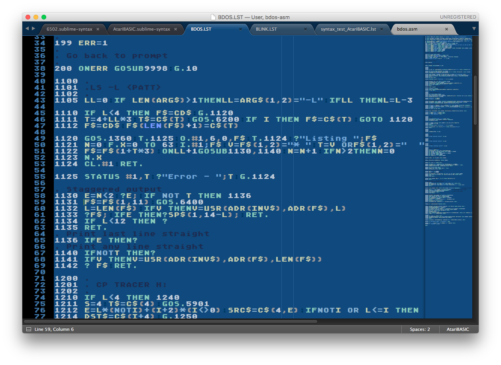

# 6502-Tools
Tools and enhancements to make working with 6502 Assembly Language on macOS more enjoyable, especially for retro-coding the Atari Computer and Atari 2600 VCS.

## For Atom

### `.atom-build.js`
This file, set up for a 2600 cartridge build, is used by Atom's standard [Build package](https://atom.io/packages/build) to specify the project build command and error pattern. Use the `AtomBuild` folder as a template for other 2600 code builds. For some cases `make` might be preferable.
- Fast build with `dasm`.
  - Set `asm_name` in `.atom-build.js`. Then it will build with `F9` (and build-on-save, if set). Passes all errors back to the **build** module.
  - Uses `/usr/local` install of '`dasm`' and '`vcs`' to build the project. Change if needed.
  - Public domain 2600 combat game source code included for testing.

## For Sublime Text 3

Copy the contents of the `Sublime` folder to your `Packages/User` folder (e.g., `~/Library/Application Support/Sublime Text 3/Packages/User`). Edit `AtariTools.sh` to configure the paths of your installed emulators and build tools. See below for the other tools you'll need.

### Atari Look-and-Feel

#### `Atari800.tmTheme`
The Atari800 theme provides the classic Atari blue-colored background and bluish-white text, plus extra color-coding used by the syntaxes for AtariBASIC and bAtariBASIC.

For the most authentic experience editing LST files, free Atari classic fonts (see below) may be installed to get full ATASCII support via the Unicode user-defined area (work-in-progress).

### AtariTools Settings
`AtariTools.sh` is the common location where you'll set up the paths to your tools and other settings. Use this file to set the path to `atari800` (default is MacPorts `/opt/local/bin`), the path to your `HardDrive1` folder, preferred Atari 800 emulator, emulation settings, etc. For the Atari 800, you can mount up to 2 floppy disk images. (At least one floppy is required to get a DOS loaded.)

For bAtariBASIC, the `$bB` environment variable should already exist, but it can be set or overridden here if needed.

### 6502 Support

#### `6502.sublime-settings`
Settings suitable for 6502 code. Applies to `.asm` and `.s` files.

#### `6502.sublime-syntax`
A pretty smart syntax parser for *Atari* and *Apple* 6502 code with some fixes compared to others.
- Parses well-formed `dasm`, `ca65`, and *Atari 8-bit* syntax.
- Mostly good at auto-finding the end of valid commands, so it can parse code with implicit comments (e.g., *Apple DOS*).
- Includes `syntax_test_6502.asm` to test the markup with Sublime [PackageDev](https://packagecontrol.io/packages/PackageDev) (Cmd-B).

#### `LD65Config.sublime-syntax`
Syntax coloring for `.lnk` files (used with `ld65 -C`).

### Atari VCS Build

#### `Atari VCS.sublime-build`
Uses '`dasm`' with the '`vcs`' libraries to build the active 6502 source file for the Atari 2600 and run it in the configured emulator. This is the preferred build method during game development. It doesn't (currently) kill previous instances of `atari800`, so be sure to quit them to ensure they don't pile up!

### bAtariBasic Support
To help with the development of bAtariBasic, I've created a proper Github fork of [bAtariBASIC](https://github.com/thinkyhead/bAtariBasic) where I'm cleaning up code, fixing bugs, and integrating [64K support by RevEng](http://atariage.com/forums/topic/214909-bb-with-native-64k-cart-support-11dreveng/) (v39 2017-01-08). I highly recommend working with this fork as it goes forward.

#### `bAtariBASIC.sublime-settings`
Settings for bAtariBASIC (.BAS) files, including the use of the Atari800 theme (no special font) to gain the extra syntax highlighting.

#### `bAtariBASIC.sublime-syntax`
Context-aware syntax coloring of bAtariBASIC 1.1 syntax with built-in error-checking. (work-in-progress)

### AtariBASIC Support
AtariTools includes AtariBASIC syntax parsing/coloring and a build command to run AtariBASIC in your preferred Atari 800 emulator.

#### `AtariBASIC.sublime-settings`
This file provides the hook for Sublime to use the `Atari800` theme for `.LST` files, to show rulers at multiples of 38/40 characters, and to draw a final ruler at 254 characters. If the **Atari Classic Int** font is installed, it will be used. (This font will be required for full ATASCII support in future.)

#### `AtariBASIC.sublime-syntax`
This file provides context-aware syntax coloring of AtariBASIC with built-in error-checking. Syntax coloring makes it even easier to write AtariBASIC and instantly catch syntax errors. Best with `Atari800.tmTheme` and the Atari Classic fonts.

#### `AtariBASIC.sublime-build`
This adds `Tools` > `Build System` > `AtariBASIC` to the menu so you can use **Build** `Command-B` to load and run the active LST file in the Atari 800 emulator.

The **Build** command will run the current BASIC file in **atari800** or **Atari800MacX**, depending on which was last selected. Make sure your **atari800** and **Atari800MacX** default settings have BASIC enabled, a local folder exposed as hard drive H:, and up to two floppies mounted for development purposes.

The **Build** command saves the current file as **SUBLIME.LST** in your configured Atari hard drive (H:) folder and tells the emulator to load and run **H:SUBLIME3.LST**, so file loading is about as fast as it can be.

NOTE: Currently there's no support for Atari special characters, which would require an input method, translation between Unicode and ATASCII, etc. For now, use `CHR$` and other techniques to program special characters while this is sorted out.

## Other things you'll need…
  - [Sublime Text 3](https://www.sublimetext.com/3) - A light and fast extensible editor with a Python core. Can use TextMate bundles.
  - [Atom](http://atom.io) - A powerful modular editor. May run sluggishly on older systems.
  - [atari800](https://atari800.github.io/) - A good, working Atari emulator that fails much of the acid test but runs pretty well. (Use F1 for settings!) Also available via package managers like [MacPorts](https://www.macports.org/ports.php?by=name&substr=atari800) and [Homebrew](https://formulae.brew.sh/formula/atari800#default).
  - [Atari800MacX](http://www.atarimac.com/atari800macx.php) - A build from 2012 that mostly works with macOS Sierra - but **disable sound** or it will crash! (The project needs a new Quartz-based UI and other code updates before building with current Xcode is possible.)
  - [Atari Classic Fonts](http://members.bitstream.net/marksim/atarimac/fonts.html) - Regular, Chunky, Smooth, and ExtraSmooth - especially for use with `Atari800.tmTheme`. The newest all-in-one font is preferred, because it has full ATASCII support.
  - [Eightbit-Atari-Fonts](https://github.com/TheRobotFactory/EightBit-Atari-Fonts) - Many more Atari custom fonts for use with `Atari800.tmTheme`.
  - [dasm](http://dasm-dillon.sourceforge.net) - A 6502 cross-assembler most commonly used to build Atari 2600 code. Also included with bAtariBASIC.
  - [cc65](https://github.com/cc65/cc65) - A C cross-compiler for many 6502 platforms. A rich set of libraries is included.
  - [ca65](https://github.com/cc65/cc65) - A 6502 macro-assembler, also including headers for many 6502 platforms.
  - [Atari tools](https://github.com/jhallen/atari-tools) - Includes the `atr` command-line tool to manage ATR disk images and files.

## Upcoming Plans
- Better support for Batari Basic in the macOS ecosystem. Playfield/sprite tools (web-based, Javascript).
