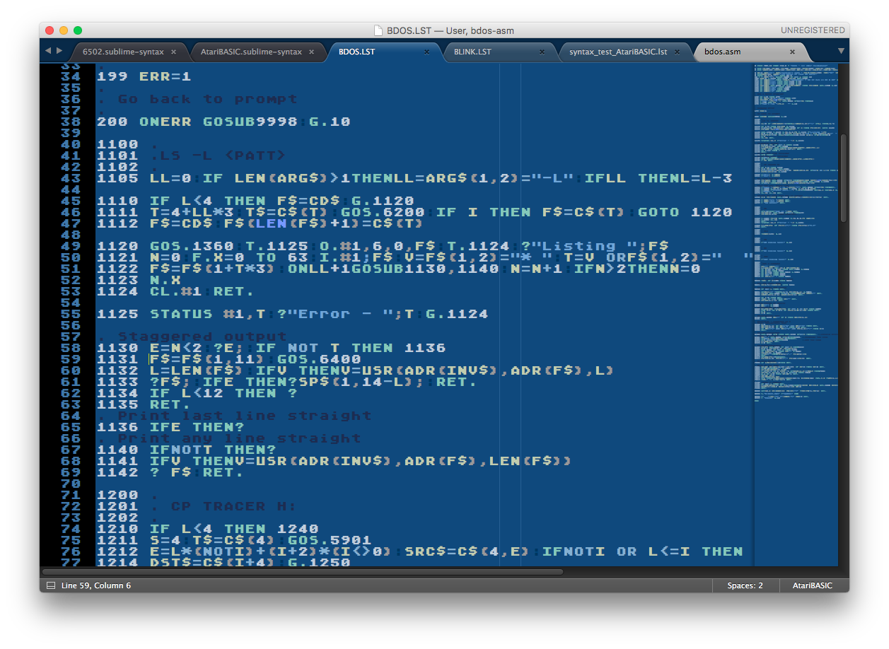

# 6502-Tools
Tools and enhancements to make working with Atari and Commodore 64 Assembly Language on macOS more enjoyable, with additional utilities for retro-coding in Atari BASIC, Atari 2600 Batari Basic, and Commodore 64 BASIC.

## For Sublime Text 3
To install these plugins use the menu item **Sublime Text** > **Settings** > **Browse Packages…** to open the `Packages` folder and copy the included `AtariTools` and/or `C64Tools` plugin folders there.
- The [**AtariTools**](Sublime/AtariTools) Sublime Text plugin includes Syntax Coloring and Build Commands to enhance your classic Atari 8-bit coding experience in 6502 Assembly, AtariBASIC, and Batari BASIC.
- The [**C64Tools**](Sublime/C64Tools) Sublime Text plugin includes Syntax Coloring and Build Commands to enhance your classic Commodore 64 6502 Assembly and Commodore BASIC coding experience.

For the complete suite you should also install:
- The [*ATASCII Sublime Text Plugin*](//github.com/thinkyhead/ATASCII) adds popup palettes to insert ATASCII Unicode characters, plus a command to invert ATASCII text.
- The [*PETSCII Sublime Text Plugin*](//github.com/thinkyhead/PETSCII) adds popup palettes to insert PETSCII Unicode characters, plus a command to invert PETSCII text.
- [Atari800 Color Schemes](//github.com/thinkyhead/Atari800) for total Atari immersion.
- [Commodore64 Color Schemes](//github.com/thinkyhead/Commodore64) for the ultimate Commodore 64 ambience.

## Other things you'll need…
  - [Sublime Text](//www.sublimetext.com/) - A light and fast extensible editor with a Python core. Can use TextMate bundles.
  - [atari800](//atari800.github.io/) - A good, working Atari emulator that fails much of the acid test but runs pretty well. (Use F1 for settings!) Also available via package managers like [MacPorts](//www.macports.org/ports.php?by=name&substr=atari800) and [Homebrew](//formulae.brew.sh/formula/atari800#default).
  - [Atari800MacX](//github.com/atarimacosx/Atari800MacX) - This nice Mac UI wrapper for Atari800. There's a Universal version 6.0.1 but sometimes 5.3.1 seems to work better.
  - [Atari Classic Fonts](http://members.bitstream.net/marksim/atarimac/fonts.html) - Regular, Chunky, Smooth, and ExtraSmooth - especially for use with `Atari800.sublime-color-scheme`. Use the newest all-in-one font for full ATASCII support. This is the preferred font for editing AtariBASIC.
  - [Eightbit-Atari-Fonts](//github.com/TheRobotFactory/EightBit-Atari-Fonts) - A collection of custom Atari fonts for use with `Atari800.sublime-color-scheme`.
  - [dasm](http://dasm-dillon.sourceforge.net) - A 6502 cross-assembler most commonly used to build Atari 2600 code. Also included with bAtariBASIC.
  - [cc65](//github.com/cc65/cc65) - A C cross-compiler for many 6502 platforms. A rich set of libraries is included.
  - [ca65](//github.com/cc65/cc65) - A 6502 macro-assembler, also including headers for many 6502 platforms.
  - [Atari tools](//github.com/jhallen/atari-tools) - Includes the `atr` command-line tool to manage ATR disk images and files.

## Atari BASIC Source Book
See my [Atari BASIC Source Book](//github.com/thinkyhead/AtariBASIC) repository for a nicely-curated canonical version of the source code for Atari BASIC. And keep an eye on this space because I'm working on implementing an AtariBASIC tokenizer (and runner?) in Python and JavaScript. The cleaned up source code (and the _Atari BASIC Source Book_ itself) will be very helpful in completing this challenging project.

## Future Plans
Python is a great language for quick implementations and it's natively supported in Sublime Text.
- Sublime Importer to convert Atari BASIC tokenized files.
- Tokenizer for AtariBASIC so no emulator is needed to convert LST to BAS.
- Interpreter to run and debug AtariBASIC in other environments.
- Better support for Batari Basic in the macOS ecosystem.
- Tools: Character, Map, Player/Missile, and Bitmap editing tools.
