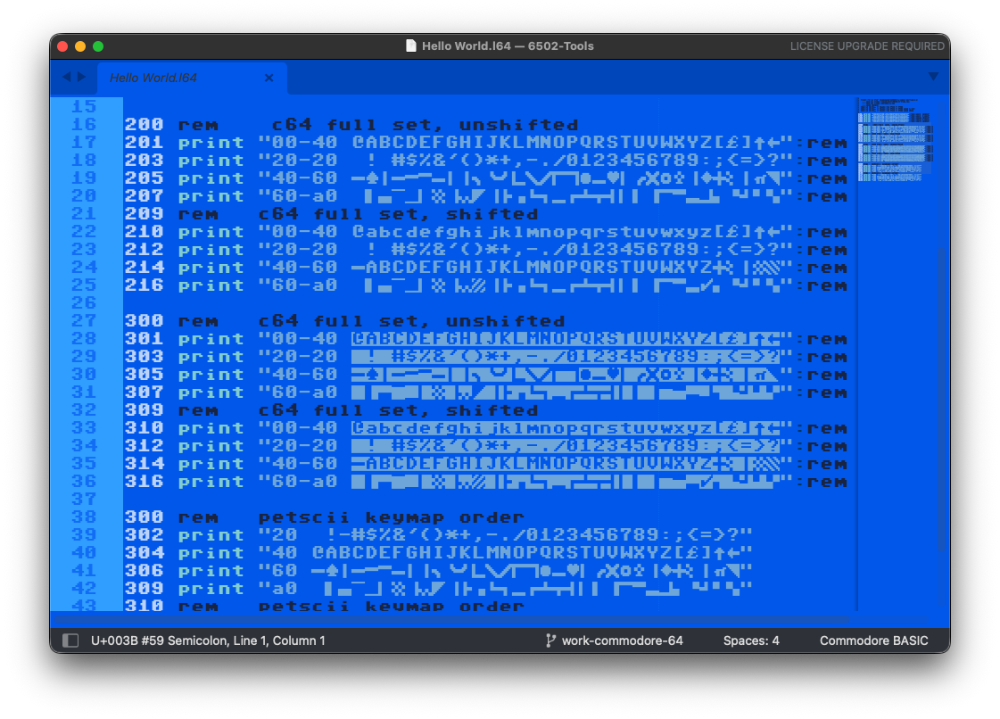

# C64Tools for Sublime Text

This plugin adds enhancements to improve the coding experience for Commodore 8-bit computers and the Commodore 2600 VCS.
- Commodore Computer color scheme, both light and dark
- 6502 Assembly and ld65 syntax highlighting
- Commodore BASIC Syntax and Build System
- Commodore VCS Build System

## Installation

In Sublime, from the menu bar select *Sublime Text* > *Settings* > *Browse Packages* to open the `Packages` folder. Then simply copy this (`C64Tools`) folder into the `Packages` folder.

### Commodore Classic Fonts
To use the C64Tools plugin you will need to install and enable the [Pet Me](https://www.kreativekorp.com/software/fonts/c64/) Font. You may also find this font set already installed as part of VICE. For example with Homebrew…
```sh
ls /opt/homebrew/Cellar/vice/3.10/share/vice/common
```

### C64Tools Settings

You'll need to edit `C64Tools-settings.sh` to use the included Build Systems. This is where you'll set the path to `atari800` (default is MacPorts `/opt/local/bin`), the path to your `HostDrive9` folder, preferred Commodore 800 emulator, emulation settings, etc. For the Commodore 800, you can mount up to 2 floppy disk images. (At least one floppy is required to get a DOS loaded.)

### Commodore Look-and-Feel

#### `C64.tmTheme`
The Commodore800 theme provides the classic Commodore blue-colored background and bluish-white text, plus extra color-coding used by the syntax for CommodoreBASIC.

In order to edit Commodore BASIC (`.L64`) files you'll need to install the free Pet Me font (see above). This font provides full PETSCII support by mapping the whole character set —including special characters— to the Unicode user-defined area (PUA). The CommodoreBASIC Build System automatically translates the Unicode code from Sublime to PETSCII special characters when passing the code to the emulator for loading.



### Commodore BASIC Support
C64Tools includes Commodore BASIC syntax parsing/coloring and a build command to run Commodore BASIC in your preferred Commodore 800 emulator.

#### `CommodoreBASIC.sublime-settings`
This file provides the hook for Sublime to use the `C64` theme for `.L64` files, defines rulers at multiples of 38/40 characters, and a max length ruler at 254 characters. If the **Pet Me** font is installed, it will be used. (This font is needed for proper PETSCII support in Sublime.)

#### `CommodoreBASIC.sublime-syntax`
This syntax provides context-aware syntax coloring of Commodore BASIC with built-in error-checking. It makes the code much more readable with standard code fonts, but of course it looks best with `C64.tmTheme`. A work in progress, it needs better expression handling. Syntax test included.

#### `CommodoreBASIC.sublime-build`
This adds `Tools` > `Build System` > `Commodore BASIC` to the menu so you can use **Build** `Command-B` to load and run the active L64 file in your favorite Commodore 800 emulator.

The **Build** command will run the current BASIC file in **VICE**, depending on what you last selected under **Build With…**. Make sure your **VICE** default settings have BASIC enabled. It can also be useful to have a local folder exposed as hard drive H:, and up to two floppies mounted for development purposes.

**Build** saves a copy of the current file with PETSCII encoding and pastes it into the emulator. It may help to enable Turbo in the emulator to speed things up.

### C64 6502 Assembly Support

#### `C64 Assembly.sublime-settings`
Settings suitable for 6502 code. Applies to `.asm` and `.s` files.

#### `C64 Assembly.sublime-syntax`
This syntax parser for 6502 code needs more work to support modern formats. I'll continue to enhance this whenever I do 6502 coding.
- For best results with `ca65` code use the **ca65 Syntax** included with ["65816" Package](//github.com/ksherlock/65816.tmbundle).
- Includes `syntax_test_C64.asm` to test the markup with Sublime [PackageDev](https://packagecontrol.io/packages/PackageDev) (Cmd-B).

## Helper Scripts

### `C64Tools-settings.sh`
**_Edit this file!_** The `C64Tools-settings.sh` file contains the configuration values and file paths that will be used by the helper scripts. Provide paths to your emulators and your "H1:" hard drive folder.

### `CommodoreBASIC-run.sh`
Used by the **Build** command to run Commodore BASIC code in the emulator you have configured in the `C64Tools-settings.sh` script.

### `C64-build.sh`
Build and run Commodore Assembly Language code with `ca65` / `cl65`.

### `print-to-sublime-C64.sh`
This wrapper for `petunia.py` is used to pipe "P:" device output from `VICE` to Sublime Text (`subl`).
- Configure the `VICE` "Print Command" to use this script. Include the full path.

### `petunia.py`
Python script to convert text from PETSCII to Unicode and back again.
