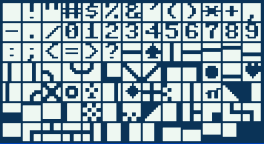
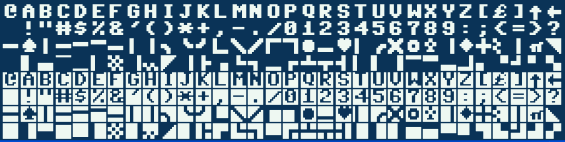
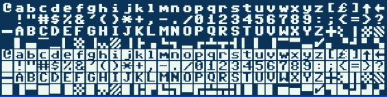
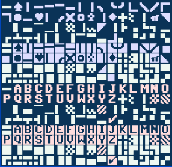
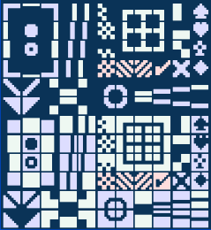

# PETSCII
### Sublime Text Plugin for PETSCII Unicode

Use this in conjunction with [C64Tools](../C64Tools) to edit C64 BASIC the modern way. Requires [Pet Me](https://www.kreativekorp.com/software/fonts/c64/) Font.

#### Insert Character

Press <kbd>Ctrl+Shift+C</kbd> <kbd>Ctrl+Shift+C</kbd> to open popup panel with PETSCII Inverted Characters. Click to insert a character.

Press <kbd>Ctrl+Shift+C</kbd> <kbd>Ctrl+Shift+1</kbd> to open popup panel with PETSCII Unshifted Characters. Click to insert a character.

Press <kbd>Ctrl+Shift+C</kbd> <kbd>Ctrl+Shift+2</kbd> to open popup panel with PETSCII Shifted Characters. Click to insert a character.

Press <kbd>Ctrl+Shift+C</kbd> <kbd>Ctrl+Shift+S</kbd> to open popup panel with PETSCII Special Characters. Click to insert a character.

Press <kbd>Ctrl+Shift+C</kbd> <kbd>Ctrl+Shift+D</kbd> to open popup panel with PETSCII Draw Characters. Click to insert a character.

#### Invert Selected Text

Press <kbd>Ctrl+Shift+C</kbd> <kbd>Ctrl+Shift+I</kbd> to invert the selected text, replacing all normal characters with inverted characters and _vice-versa_.
